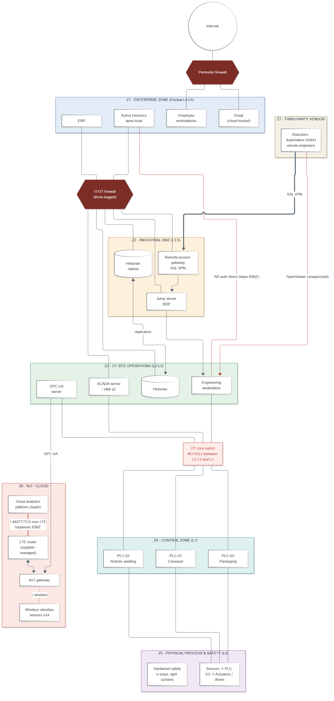

# Apex Manufacturing Ltd. - factory architecture

> **Fictional case study.** Apex Manufacturing Ltd., RoboServ Automation GmbH and every system described here are invented for this assessment.

## 1. Company profile

| | |
|---|---|
| Company | Apex Manufacturing Ltd. |
| Site | Plant 1, a single-site automotive components plant |
| Product | Machined and robot-welded brake caliper brackets and suspension mounts for two automotive OEMs |
| People | ~450 (320 office/IT users, 130 shop-floor) |
| Operations | 3 shifts, 24x5 production |
| Value at risk | ~£180,000 of finished goods per production day |
| Quality regime | IATF 16949: weld and torque records must be kept for part traceability |

Two OEM customers take 85% of output under just-in-sequence contracts with penalty clauses. Because of this, a **line stop of more than one day** and a **quality escape** (defective parts shipped) are the outcomes the business fears most. Both are reflected in the impact scale ([risk-methodology.md](../risk-assessment/risk-methodology.md)).

## 2. Production process

```
Raw stock -> CNC machining -> PLC-01 Conveyor -> PLC-02 Robotic welding cell -> PLC-03 Packaging -> Shipping
                                   |                     |                              |
                                   +----- sensors / drives / actuators (Level 0) -------+
```

* **PLC-01 Conveyor** moves parts from machining to the weld cell and buffers them between operations.
* **PLC-02 Robotic welding cell** sequences a six-axis robot and a weld controller. Its weld current and timing parameters directly determine part quality.
* **PLC-03 Packaging** handles packing, labelling and palletising for the OEM shipments.
* **Safety:** e-stops, light curtains and door interlocks are wired through **hardwired safety relays** that are independent of the PLCs and not reachable over the network. The assessment treats safety functions as outside the cyber attack surface. This assumption lowers the safety impact of PLC manipulation, but it does not remove the equipment-damage or quality impact.

## 3. Architecture



Diagram source: [`diagrams/src/factory-architecture.mmd`](../diagrams/src/factory-architecture.mmd) (Mermaid).

| Zone | Purdue | Components |
|---|---|---|
| Z1 Enterprise | L4-L5 | Employee workstations, Active Directory (`apex.local`), ERP, cloud email |
| Z2 Industrial DMZ | L3.5 | Historian replica, jump server (RDP), remote-access gateway (SSL VPN) |
| Z3 OT Site Operations | L2-L3 | SCADA server + 2 HMIs, engineering workstation, process historian, OPC UA server, OT core switch |
| Z4 Control | L1 | PLC-01, PLC-02, PLC-03 |
| Z5 Process & Safety | L0 | Sensors, drives, actuators, hardwired safety circuits |
| Z6 IIoT / Cloud | - | 24 wireless vibration sensors, IIoT gateway, supplier-managed LTE router, SaaS analytics |
| Z7 Vendor | external | RoboServ Automation GmbH, remote PLC / robot-cell maintenance |

### Smart-factory (IIoT) extension

Two years ago Apex added predictive maintenance:

```
Wireless vibration sensors --+
                             +--> IIoT gateway --> LTE router --> Cloud analytics platform
OPC UA server (PLC tags) ----+
```

The IIoT supplier installed the gateway together with **its own LTE router**, so that the deployment would not depend on Apex IT. As a result, the gateway is connected both to the OT network and to the Internet, and **none of the IDMZ controls apply to it**.

### Third-party vendor access

RoboServ engineers support the robot cell and the PLC programs remotely:

```
Vendor engineer -> Internet -> SSL VPN -> Jump server -> Engineering workstation -> PLC
```

All RoboServ engineers share a single VPN account. During the assessment we also found that **TeamViewer had been installed on the engineering workstation** as an "emergency" path. IT did not know it was there.

## 4. Key architectural observations

These observations come from (simulated) documentation review and stakeholder interviews. They drive most of the high-scoring threats.

| # | Observation | Related threats |
|---|---|---|
| O-1 | OT Windows hosts are joined to the corporate `apex.local` domain, so AD authentication goes directly from OT to IT and bypasses the IDMZ | T-08, T-17 |
| O-2 | The IT/OT firewall contains a "temporary" any-any rule (2024 robot-cell project) and direct RDP/SMB from the IT admin subnet | T-10 |
| O-3 | Nothing is enforced between Site Operations (L2-L3) and Control (L1): any OT host can reach any PLC on any port | T-02, T-05, T-15, T-21 |
| O-4 | PLC key switches are left in REMOTE, so programs can be downloaded at any time | T-02, T-21, T-22 |
| O-5 | The vendor VPN uses one shared password-only account that is always enabled. TeamViewer is installed on the EWS | T-01, T-24 |
| O-6 | The IIoT gateway is dual-homed with its own LTE uplink, and its web admin interface still has default credentials | T-11, T-13 |
| O-7 | The only copies of the PLC/HMI projects are on the EWS. There is no tested OT recovery | T-27, T-17 |
| O-8 | All operators share one HMI account, and PLC changes are not versioned | T-03, T-23 |

See also: [asset inventory](asset-inventory.md) · [data flows & trust boundaries](data-flows.md) · [zone/conduit diagram](../diagrams/network-zones.png).
