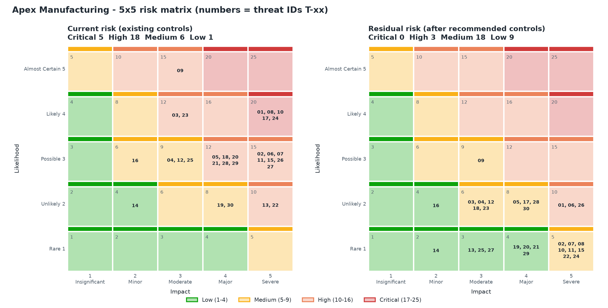

<!-- GENERATED by tools/build_markdown.py from tools/data.py - do not edit by hand -->

# Top 10 risks

Ranking rule: score, then impact, then number of attack scenarios the threat enables, then ID.

| Rank | ID | Risk | STRIDE | Score | Scenarios | Priority controls | Residual |
|---|---|---|---|---|---|---|---|
| 1 | T-08 | Corporate AD compromise grants OT access | Spoofing | 20 🔴 Critical | AS-02, AS-05 | SC-02, SC-04 | 5 🟡 Medium |
| 2 | T-10 | Permissive IT/OT firewall rules bypass IDMZ | Elevation of Privilege | 20 🔴 Critical | AS-02, AS-05 | SC-02 | 5 🟡 Medium |
| 3 | T-01 | Stolen vendor credentials used on VPN | Spoofing | 20 🔴 Critical | AS-01 | SC-01, SC-04, SC-16 | 10 🟠 High |
| 4 | T-17 | Ransomware encrypts SCADA/HMI | Denial of Service | 20 🔴 Critical | AS-05 | SC-02, SC-06, SC-08, SC-14 | 8 🟡 Medium |
| 5 | T-24 | Unapproved TeamViewer on engineering workstation | Spoofing | 20 🔴 Critical | AS-01 | SC-01, SC-06, SC-02 | 5 🟡 Medium |
| 6 | T-02 | Unauthorized PLC logic modification | Tampering | 15 🟠 High | AS-01, AS-03 | SC-07, SC-03, SC-10 | 5 🟡 Medium |
| 7 | T-06 | Malware gains admin rights on engineering workstation | Elevation of Privilege | 15 🟠 High | AS-01, AS-03 | SC-06, SC-04, SC-13 | 10 🟠 High |
| 8 | T-15 | Unauthenticated Modbus write commands | Tampering | 15 🟠 High | AS-02, AS-04 | SC-03, SC-10 | 5 🟡 Medium |
| 9 | T-27 | No usable backup of PLC programs and HMI projects | Denial of Service | 15 🟠 High | AS-03, AS-05 | SC-08 | 3 🟢 Low |
| 10 | T-07 | Jump server used as pivot into OT | Elevation of Privilege | 15 🟠 High | AS-02 | SC-05, SC-02, SC-04 | 5 🟡 Medium |

## Distribution

| Rating | Current | Residual |
|---|---|---|
| 🔴 Critical | 5 | 0 |
| 🟠 High | 18 | 3 |
| 🟡 Medium | 6 | 18 |
| 🟢 Low | 1 | 9 |

